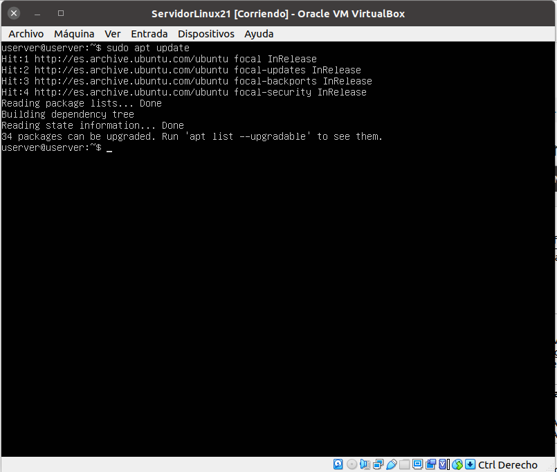
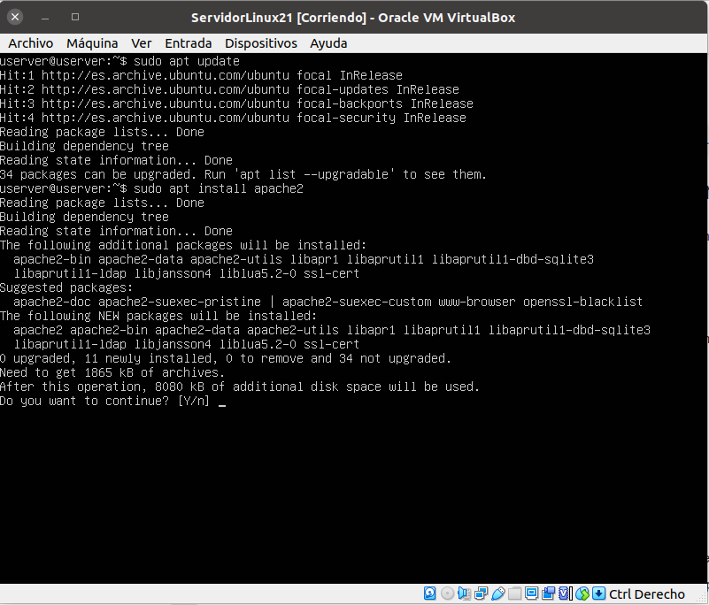
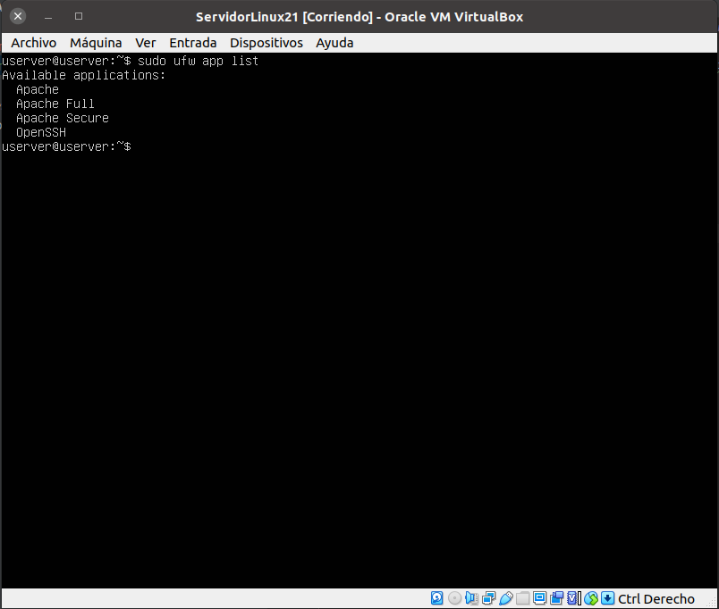
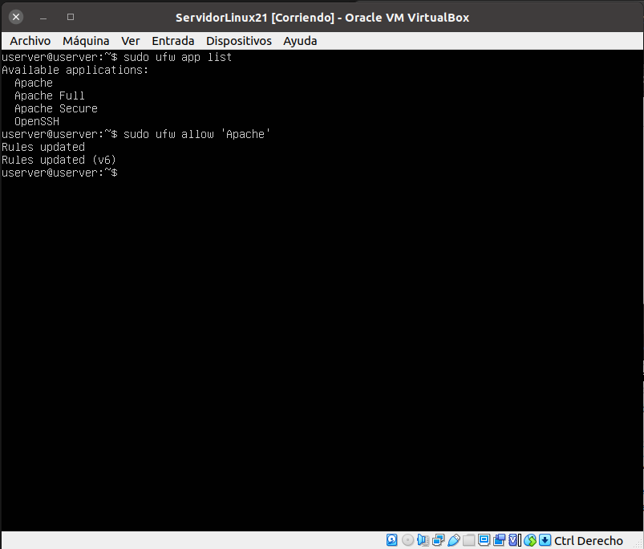
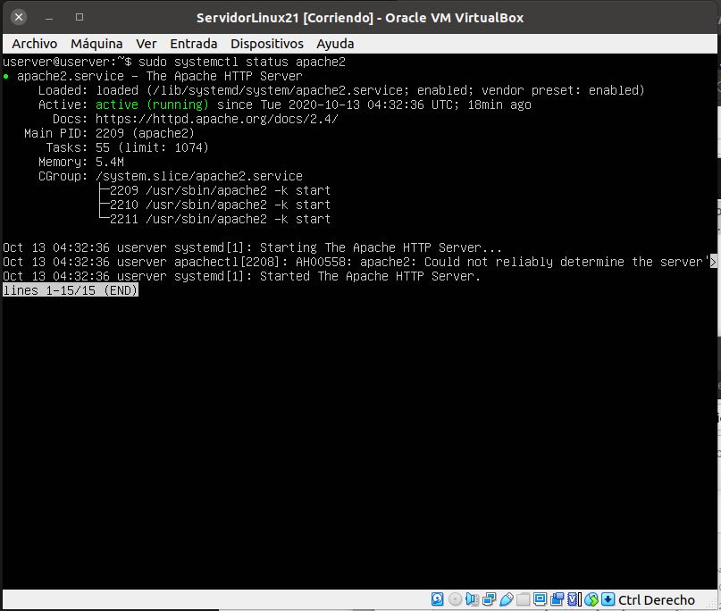
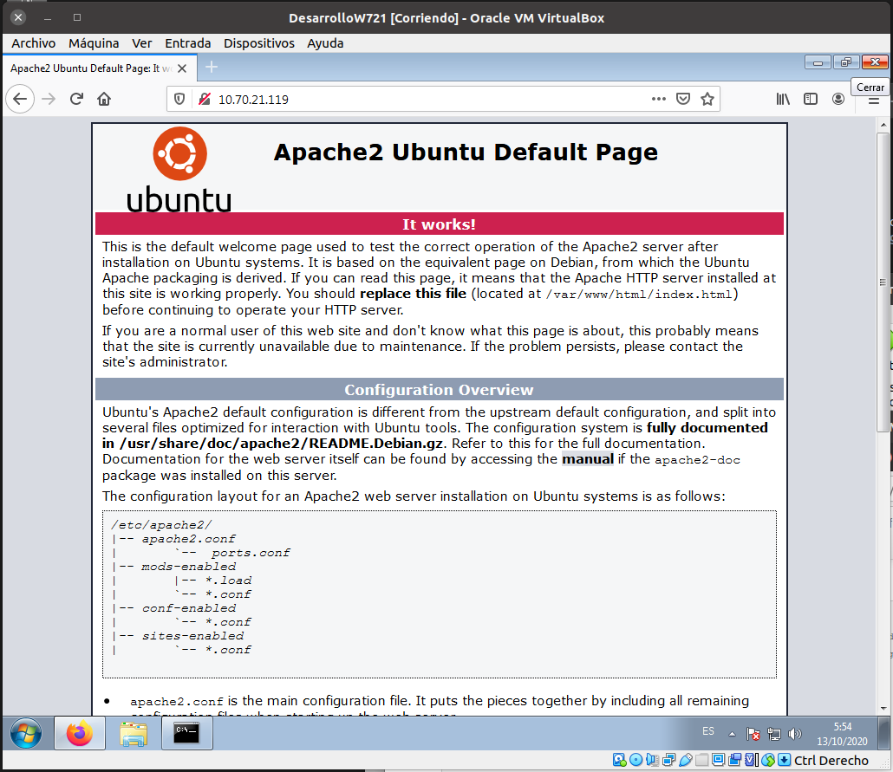

# 2.2- Instalación del servidor web Apache en Ubuntu Server
## 1. Instalar Apache.
1.1.- ejecuro sudo apt update para actualizar los binarios del repositorio de ubuntu

1.2.-ejecuto apt install apache2

## 2. Configurar el firewall.

2.1.- ejecuto el comando sudo ufw app list 

2.2.- ejecuto sudo ufw allow 'Apache'. Compurebo el estado del firewall con sudo ufw status y lo activo con sudo ufw enable

## 3. Comprobar el estado del servidor web.

3.1.- compuebo que apache esta levantado con sudo systemctl status apache2

tambien es accesible desde la red

